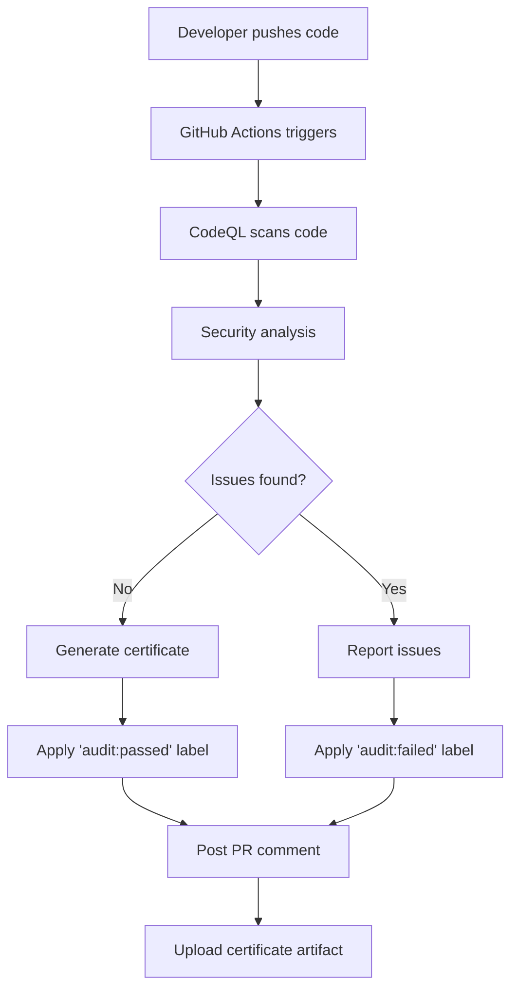

# Automated Code Audit System - Quick Start

## 🚀 System Overview

The CyberAi.network automated code audit system provides continuous security monitoring and certificate generation for your repository.

## 📋 What Happens When You Push Code



## 📊 Audit Certificate Example

When your code passes the audit, you receive a certificate like this:

```markdown
# Code Audit Certificate

## Certificate Information
- Certificate ID: abc-123-def-456
- Issue Date: 2026-01-03 12:00:00 UTC
- Valid Until: 2026-04-03 12:00:00 UTC
- Status: PASSED ✅

## Repository Information
- Repository: SolanaRemix/code-audit
- Branch: main
- Commit: a1b2c3d4e5f6

## Audit Details
- CodeQL Scanning: Completed
- Vulnerability Check: Passed
- Code Quality: Verified
- Critical Issues: 0
- High Severity: 0
```

## 🏷️ Label System

Your PRs automatically receive labels:

| Label | Badge | Meaning |
|-------|-------|---------|
| `audit:passed` |  | All security checks passed |
| `audit:failed` |  | Security issues found |
| `security:verified` |  | Security approved |

## 🔄 Workflow Triggers

The audit runs automatically on:

1. **Push to main/master/develop** - Immediate audit
2. **Pull Request** - Before merge approval
3. **Weekly Schedule** - Every Monday at 9 AM UTC
4. **Manual Trigger** - On-demand via Actions tab

## 📝 Example PR Comment

After an audit completes, your PR receives a comment:

```markdown
## ✅ Automated Code Audit Report

**Status:** PASSED
**Audit ID:** `abc-123-def-456`
**Date:** 2026-01-03 12:00:00 UTC
**Commit:** `a1b2c3d`

### Security Analysis
- CodeQL scanning completed
- Security audit certificate generated
- Labels applied: `audit:passed`

View detailed audit certificate in the workflow artifacts.

---
*Powered by CyberAi.network Automated Audit System*
```

## 🛠️ For Developers

### Before Committing

```bash
# Optional: Run basic checks locally
python3 -m pylint your_file.py
npm audit
```

### After Pushing

1. Wait for audit to complete (usually 2-5 minutes)
2. Check PR for audit comment
3. If failed, review the issues and fix them
4. Push fixes - audit runs automatically again

### Downloading Your Certificate

1. Go to **Actions** tab
2. Click on the workflow run
3. Scroll to **Artifacts** section
4. Download `audit-certificate-[ID]`

## 🔐 Security Features

- **CodeQL Analysis**: Industry-standard security scanning
- **Multi-language Support**: JavaScript, Python, and more
- **Vulnerability Detection**: Finds common security issues
- **Best Practices**: Enforces coding standards
- **Certificate Verification**: SHA-256 hash validation

## 📚 File Structure

```
code-audit/
├── .github/
│   ├── workflows/
│   │   └── code-audit.yml          # Main workflow
│   ├── scripts/
│   │   └── generate_certificate.py # Certificate generator
│   ├── codeql-config.yml           # CodeQL configuration
│   └── ISSUE_TEMPLATE/
│       └── manual-audit-request.md # Manual audit template
├── docs/
│   ├── README.md                   # Documentation
│   └── audit_certificate.md        # Generated certificates
├── README.md                       # Main documentation
├── CONTRIBUTING.md                 # Contribution guide
└── .gitignore                      # Git ignore rules
```

## 🎯 Quick Commands

```bash
# Manually trigger audit
gh workflow run code-audit.yml

# View workflow status
gh run list --workflow=code-audit.yml

# Download latest certificate
gh run download

# View labels on a PR
gh pr view 123 --json labels
```

## ✨ Benefits

✅ **Automated Security** - No manual intervention needed
✅ **Immediate Feedback** - Know about issues before merge
✅ **Audit Trail** - Complete history of all audits
✅ **Compliance** - Certificates for regulatory requirements
✅ **Transparency** - Public visibility of security status

## 🔗 Additional Resources

- [Full Documentation](README.md)
- [Contributing Guide](CONTRIBUTING.md)
- [GitHub Actions Docs](https://docs.github.com/en/actions)
- [CodeQL Documentation](https://codeql.github.com/)

---

**Ready to start?** Just push code and the system handles the rest! 🚀
